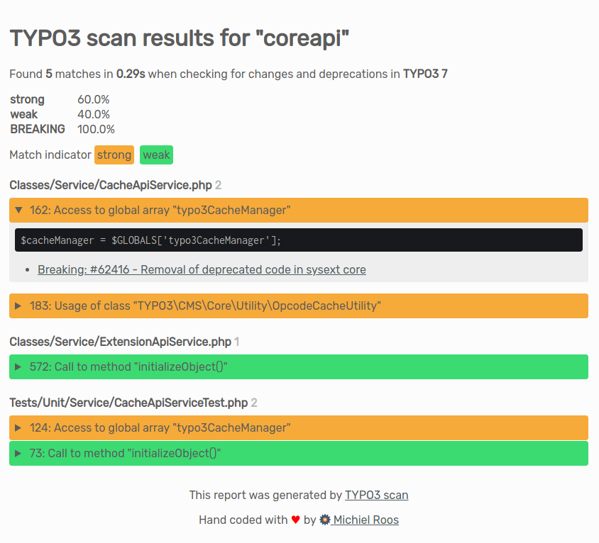
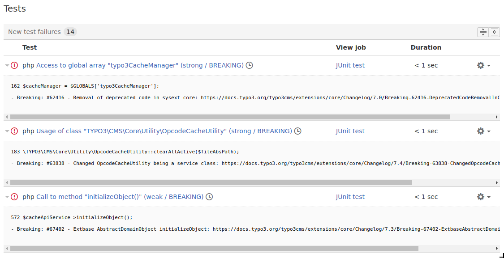

# TYPO3 scanner
Scans code for usage of deprecated and or changed code.

[](https://asciinema.org/a/201851?autoplay=1)

TYPO3 publishes [breaking changes and deprecations since version 7](https://docs.typo3.org/typo3cms/extensions/core/stable/Index.html).

This tool scans a folder for any code that is broken or deprecated. It's a wrapper around the [TYPO3 scanner library](https://github.com/ohader/scanner) that has been extracted from the TYPO3 v9 core. You can scan for deprecations and breaking changes for v7, v8, v9 and v10.

## Is TYPO3 scan helping you to migrate your TYPO3 site more smoothly?
Then please consider a sponsorship so I can make this tool even more awesome!
- Become a patron on [Patreon](https://www.patreon.com/michielroos)
- Make a donation via [PayPal](https://paypal.me/MichielRoos)

Thank you! ♥

## Requirements
The scanner requires **PHP 7.0** or higher to run. Why? *Because this tool was written in 2018!* Still running that old site on PHP 5.6? Move your extensions over to a system with PHP 7.0+ to scan them.

If there is enough demand I can downgrade components of the scanner so it can also run on PHP 5.6. This would also mean that the TYPO3 scanner library will need to be adjusted. It is taken from the TYPO3 9 core which requires PHP 7.2 at the time of writing. This sounds like quite a hassle to me, so if you want to run the LTS version of TYPO3 . . . ugrading your PHP version is the preferred practice.

## Installation
Install into an existing composer project:
```bash
composer require "michielroos/typo3scan"
```

## Usage
### Scan a path
Specify a path to scan.
```bash
php ./typo3scan.phar scan ~/tmp/source
```

### Scan for changes in certain TYPO3 version
By default the scanner scans for breaking changes and deprecations in the most recent version of TYPO3. At the time of writing, this is version `10`.
- long option: `--target`
- short option: `-t`
- values: `7`, `8`, `9` and `10`
- default: `10`
```bash
php ./typo3scan.phar scan --target 8 ~/tmp/source
```

### Show only certain types of changes
You can filter out specific change types (breaking, deprecation, feature, important)
- long option: `--only`
- short option: `-o`
- values: `breaking`, `deprecation`, `feature`, `important`
- default: `breaking,deprecation,feature,important`
```bash
php ./typo3scan.phar scan --only breaking ~/tmp/source

php ./typo3scan.phar scan --only breaking,deprecation ~/tmp/source
```

### Show only certain indicator types (strong / weak)
You can filter out specific indicator types (strong, weak)
- long option: `--indicator`
- short option: `-i`
- values: `strong`, `weak`
- default: `strong,weak`
```bash
php ./typo3scan.phar scan --indicator weak ~/tmp/source

php ./typo3scan.phar scan --indicator strong ~/tmp/source
```

### Change output format
You can specify a different output format.
- long option: `--format`
- short option: `-f`
- values: `html`, `junit`, `markdown`, `plain`
- default: `plain`
```bash
php ./typo3scan.phar scan --format markdown ~/tmp/source
```

### Specify report filename
Instead of piping the output to a file, typo3scanner can write directly to a report file
- long option: `--reportFile`
- short option: `-r`
```bash
php ./typo3scan.phar scan -r ~/tmp/report.txt ~/tmp/source
```

### Specify custom template folder
You can output in ANY format of your choosing by specifying a custom templatePath. 
- long option: `--templatePath`

The scanner looks for a file with the name `Format.twig`. So if you create a HTML template and store that in `~/path/to/templates/Html.twig`, then you can generate a HTML report with the following command:
```bash
php ./typo3scan.phar scan --format html --templatePath ~/path/to/templates ~/tmp/source
```
If you want to output the report as Restructured Text, you would create a `Rst.twig` template and generate rest using:
```bash
php ./typo3scan.phar scan --format rst --templatePath ~/path/to/templates ~/tmp/source
```

### Capture output in a file
You can redirect the output to a file
```bash
php ./typo3scan.phar scan --format markdown  ~/tmp/source > source.md
```

### Loop over a list of extensions
If you have a list of extension keys you want to scan, you can do something like:
```bash
for e in `cat ~/extensions.txt`;
do
    php ./typo3scan.phar scan --format markdown  ~/tmp/ext/$e > ~/tmp/reports/$e.md;
done
```

### Run the TYPO3scan tool from within Gitlab CI

Check multiple extensions in the folder `web/typo3conf/ext/` adjust that path if needed.

The result is an artifact which contains a `Build/Report/Deprecations` where you have a file per extension and TYPO3 Version 7, 8, 9 and 10.

This way you can easily review each extension.

With the planned junit ouput this can be nicely integrated into the gitlab merge request widget as well.

```
checkDeprecations:
  image: docker.kay-strobach.de/docker/php:7.1
  stage: test
  variables:
    SCANNER_RELEASE: "https://github.com/Tuurlijk/typo3scan/releases/download/1.3.0/typo3scan.phar"
  script:
    - curl -L $SCANNER_RELEASE --output typo3scan.phar
    - php ./typo3scan.phar
    - mkdir -p Build/Report/Deprecations
    - for d in web/typo3conf/ext/*/ ; do (php ./typo3scan.phar scan --target 7 --format markdown $d > Build/Report/Deprecations/v7-$(basename $d).md); done
    - for d in web/typo3conf/ext/*/ ; do (php ./typo3scan.phar scan --target 8 --format markdown $d > Build/Report/Deprecations/v8-$(basename $d).md); done
    - for d in web/typo3conf/ext/*/ ; do (php ./typo3scan.phar scan --target 9 --format markdown $d > Build/Report/Deprecations/v9-$(basename $d).md); done
    - for d in web/typo3conf/ext/*/ ; do (php ./typo3scan.phar scan --target 10 --format markdown $d > Build/Report/Deprecations/v10-$(basename $d).md); done
  artifacts:
    when: on_success
    expire_in: 7 days
    paths:
    - Build
```

## Example output
You can find example templates in the [Resources/Private/Templates](./src/Resources/Private/Templates) folder.
### Plain
A part of the plain output for:
```bash
typo3scan.phar scan ~/tmp/source/powermail
```
Looks like this:
```
powermail

Found 26 matches in 1.09s when checking for changes and deprecations in TYPO3 7

strong	weak	DEPRECATION	BREAKING	
29.41%	70.59%	5.88%	94.12%	

Classes/Finisher/SendParametersFinisher.php
Call to method "isEnabled()" (weak)
60 if ($this->isEnabled()) {
Deprecation: #37171 - Deprecate t3editor->isEnabled()
https://docs.typo3.org/typo3cms/extensions/core/Changelog/7.3/Deprecation-67171-T3editorIsEnabled.html

Configuration/TCA/tx_powermail_domain_model_answer.php
Usage of array key "dividers2tabs" (strong)
14 'dividers2tabs' => true,
Breaking: #62833 - Removed dividers2tabs functionality
https://docs.typo3.org/typo3cms/extensions/core/Changelog/7.0/Breaking-62833-Dividers2Tabs.html

Usage of array key "canNotCollapse" (weak)
240 'canNotCollapse' => 1
Breaking: #67753 - Drop "Show secondary options"
https://docs.typo3.org/typo3cms/extensions/core/Changelog/7.4/Breaking-67753-DropSecondaryOptions.html

Usage of array key "_PADDING" (weak)
206 '_PADDING' => 2,
Breaking: #63846 - FormEngine refactoring
https://docs.typo3.org/typo3cms/extensions/core/Changelog/7.3/Breaking-63846-FormEngineRefactoring.html

ext_localconf.php
Access to array key "formevals" (weak)
71 $TYPO3_CONF_VARS['SC_OPTIONS']['tce']['formevals']['\In2code\Powermail\Tca\EvaluateEmail'] =
Breaking: #67749 - Force class auto loading for various hooks
https://docs.typo3.org/typo3cms/extensions/core/Changelog/7.4/Breaking-67749-ForceAutoloadingForVariousHooks.html
```
### HTML
A part of the html output for:
```bash
typo3scan.phar scan ~/tmp/source/coreapi -f html -t 7
```
Looks like this:


### Junit
A part of the junit output for:
```bash
typo3scan.phar scan ~/tmp/source/coreapi -f junit -t 7
```
Looks like this:



## Contributing
If you want to help improve this tool to reduce the amount of false positives, improve matchers, add new matchers etc., your contributions are very welcome!

You can contribute here: [TYPO3scan src repository](https://github.com/Tuurlijk/typo3scan-src)

## Sponsors
This project was generously sponsored by [Stichting Praktijkleren](https://www.stichtingpraktijkleren.nl/).
