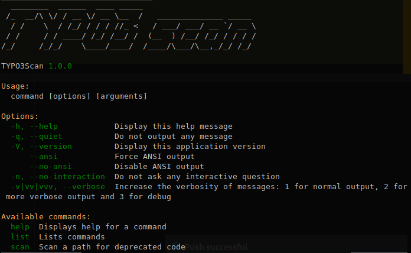

# TYPO3 scanner
Scans code for usage of deprecated and or changed code.



TYPO3 publishes [breaking changes and deprecations since version 7](https://docs.typo3.org/typo3cms/extensions/core/stable/Index.html).

This tool scans a folder for any code that is broken or deprecated. It's a wrapper around the [TYPO3 scanner library](https://github.com/ohader/scanner) that has been extracted from the TYPO3 v9 core. You can scan for deprecations and breaking changes for v7, v8 and v9.

## Requirements
The scanner requires PHP 7.0 or higher to run.

## Installation
Download the latest version from: https://github.com/Tuurlijk/typo3scan/releases

## Usage
### Scan a path
Specify a path to scan.
```bash
php ./typo3scan.phar scan ~/tmp/source
```

### Scan for changes in certain TYPO3 version
By default the scanner scans for breaking changes and deprecations in the most recent version of TYPO3. At the time of writing, this is version 9.
- long option: `--target`
- short option: `-t`
- values: `7`, `8` and `9`
```bash
php ./typo3scan.phar scan --target 8 ~/tmp/source
```

### Change output format
You can specify a different output format.
- long option: `--format`
- short option: `-f`
- values: `markdown`
```bash
php ./typo3scan.phar scan --format markdown ~/tmp/source
```

### Specify custom template folder
You can output in ANY format of your choosing by specifying a custom templatePath. 
- long option: `--templatePath`

The scanner looks for a file with the name `Format.twig`. So if you create a HTML template and store that in `~/path/to/templates/Html.twig`, then you can generate a HTML report with the following command:
```bash
php ./typo3scan.phar scan --format html --templatePath ~/path/to/templates ~/tmp/source
```
If you want to output the report as Restructured Text, you would create a `Rst.twig` template and generate rest using:
```bash
php ./typo3scan.phar scan --format rst --templatePath ~/path/to/templates ~/tmp/source
```

### Capture output in a file
You can redirect the output to a file
```bash
php ./typo3scan.phar scan --format markdown  ~/tmp/source > source.md
```

### Loop over a list of extensions
If you have a list of extension keys you want to scan, you can do something like:
```bash
for e in `cat ~/extensions.txt`;
do
    php ./typo3scan.phar scan --format markdown  ~/tmp/ext/$e > ~/tmp/reports/$e.md;
done
```

You can find example templates in the [Resources/Private/Templates](./src/Resources/Private/Templates) folder.
## Example output
A part of the plain output for:
```bash
typo3scan.phar scan ~/tmp/source/powermail
```
Looks like this:
```
powermail

Found 17 matches

strong	weak	DEPRECATION	BREAKING	
29.41%	70.59%	5.88%	94.12%	

Classes/Finisher/SendParametersFinisher.php
Call to method "isEnabled()" (weak)
60 if ($this->isEnabled()) {
Deprecation: #37171 - Deprecate t3editor->isEnabled()
https://docs.typo3.org/typo3cms/extensions/core/Changelog/7.3/Deprecation-67171-T3editorIsEnabled.html

Configuration/TCA/tx_powermail_domain_model_answer.php
Usage of array key "dividers2tabs" (strong)
14 'dividers2tabs' => true,
Breaking: #62833 - Removed dividers2tabs functionality
https://docs.typo3.org/typo3cms/extensions/core/Changelog/7.0/Breaking-62833-Dividers2Tabs.html

Usage of array key "canNotCollapse" (weak)
240 'canNotCollapse' => 1
Breaking: #67753 - Drop "Show secondary options"
https://docs.typo3.org/typo3cms/extensions/core/Changelog/7.4/Breaking-67753-DropSecondaryOptions.html

Usage of array key "_PADDING" (weak)
206 '_PADDING' => 2,
Breaking: #63846 - FormEngine refactoring
https://docs.typo3.org/typo3cms/extensions/core/Changelog/7.3/Breaking-63846-FormEngineRefactoring.html

ext_localconf.php
Access to array key "formevals" (weak)
71 $TYPO3_CONF_VARS['SC_OPTIONS']['tce']['formevals']['\In2code\Powermail\Tca\EvaluateEmail'] =
Breaking: #67749 - Force class auto loading for various hooks
https://docs.typo3.org/typo3cms/extensions/core/Changelog/7.4/Breaking-67749-ForceAutoloadingForVariousHooks.html
```
## Contributing
If you want to help improve this tool to reduce the amount of false positives, improve matchers, add new matchers etc., your contributions are very welcome!

This tool is a wrapper around the [TYPO3 scanner library](https://github.com/ohader/scanner) that has been extracted from the TYPO3 v9 core. I added the v7 and v8 matcher rules to [a fork of this repository](https://github.com/Tuurlijk/scanner).

Most of the time you will want to change the **typo3 scanner library** or your fork of it and then run that library inside the **typo3scan** tool.

### Set up the development environment
Clone the TYPO3 scanner library repository (or your fork of the scanner repository):
```bash
git clone https://github.com/Tuurlijk/scanner.git
```
Clone this repository:
```bash
git clone https://github.com/Tuurlijk/typo3scan.git
```
Add a repository entry to your `composer.json` pointing to your locally cloned *scanner library repository*. Put this one as the first one in the list.
```json
        {
            "type": "path",
            "url": "~/Projects/TYPO3/scanner/"
        },
```
Run `composer update`. Composer will now **link** the local scanner library into the **typo3scan** project. So any changes to the scanner library will be directly reflected when executing typo3scan.

### Run the TYPO3scan tool
You can execute the typo3scan tool from the `bin` directory.
```bash
cd ~/path/to/typo3scan
php ./bin/typo3scan.php ~/tmp/testExtension
```

### Make sure all the tests run for the scanner library
```bash
cd ~/path/to/scanner-library
composer install
./.Build/bin/phpunit tests/
```

## Sponsors
This project was generously sponsored by [Stichting Praktijkleren](https://www.stichtingpraktijkleren.nl/).
